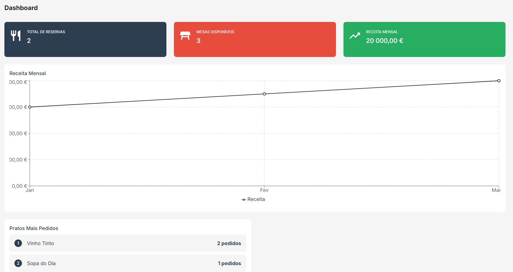
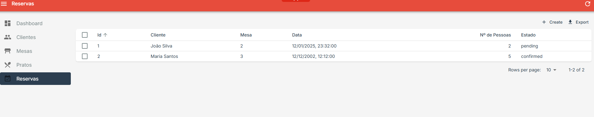
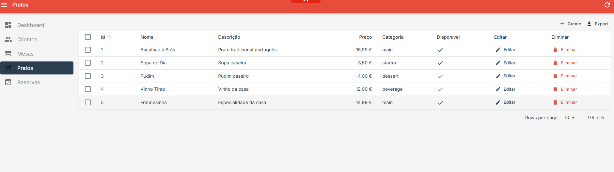

# GRestaurante - Sistema de Gestão de Restaurante

Repositório do projeto desenvolvido para a disciplina de Desenvolvimento Web I, uma disciplina do 1º semestre na Universidade da Maia. Desenvolvido pelo Grupo 10.

## Breve descrição do tema

GRestaurante é um sistema de gestão de restaurante desenvolvido com tecnologias que permitem a gestão completa de reservas, mesas, clientes e ementa. O sistema oferece uma interface administrativa intuitiva para controlar todos os aspectos operacionais de um restaurante, incluindo a gestão de reservas em tempo real e monitorização de métricas importantes através de uma dashboard informativa.

## Organização do repositório

* **Código fonte** está na pasta [src](src/)
  - [Backend](backend/) - API REST desenvolvida com Express.js
  - [Frontend](frontend/) - Interface de administração desenvolvida com React Admin
* **Documentação** está na pasta [docs](docs/)
* **Configuração do Docker** está na pasta raiz com [docker-compose.yml](docker-compose.yml)
* **Arquivos SQL** estão na pasta [SQL](SQL/)

## Galeria

| Dashboard | Reservas | Ementa |
|-----------|----------|-----------|
|  |  |  |

## Tecnologias

* [Node.js](https://nodejs.org/) - Ambiente de execução JavaScript
* [Express](https://expressjs.com/) - Framework para Node.js
* [MySQL](https://www.mysql.com/) - Sistema de gerenciamento de banco de dados
* [React](https://reactjs.org/) - Biblioteca JavaScript para construção de interfaces
* [Docker](https://www.docker.com/) - Plataforma de containerização

### Frameworks e Bibliotecas

* [React Admin](https://marmelab.com/react-admin/) - Framework para construção de painéis administrativos
* [Sequelize](https://sequelize.org/) - ORM para Node.js
* [Material-UI](https://mui.com/) - Biblioteca de componentes React
* [Recharts](https://recharts.org/) - Biblioteca de gráficos para React
* [Docker Compose](https://docs.docker.com/compose/) - Ferramenta para definir e executar aplicações Docker multi-container

## Relatório

### Apresentação do Projeto
* Capítulo 1: [Apresentação do Projeto](docs/c1.md)
  - Visão geral
  - Objetivos
  - Principais funcionalidades

### Recursos
* Capítulo 2: [Recursos](docs/c2.md)
  - Arquitetura do sistema
  - Tecnologias utilizadas
  - APIs e integrações

### Produto
* Capítulo 3: [Produto](docs/c3.md)
  - Funcionalidades implementadas
  - Modelos de dados
  - Interface do utilizador

### Apresentação
* Capítulo 4: [Apresentação](docs/c4.md)
  - Manual do utilizador
  - Guia de instalação
  - Demonstração do sistema

## Equipe
* Nuno Pereira [@nunotapxD](https://github.com/nunotapxD)
* José Cantinho [@JoseMCC69](https://github.com/JoseMCC69)
