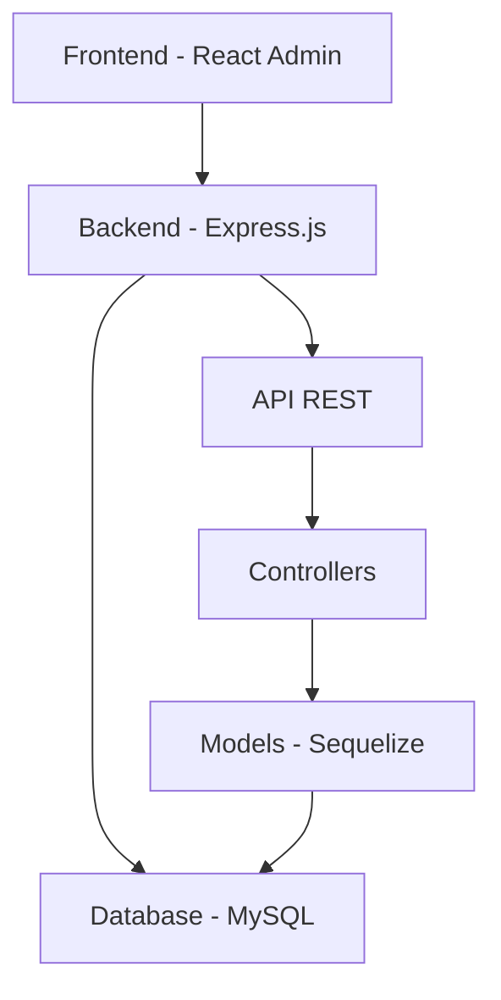
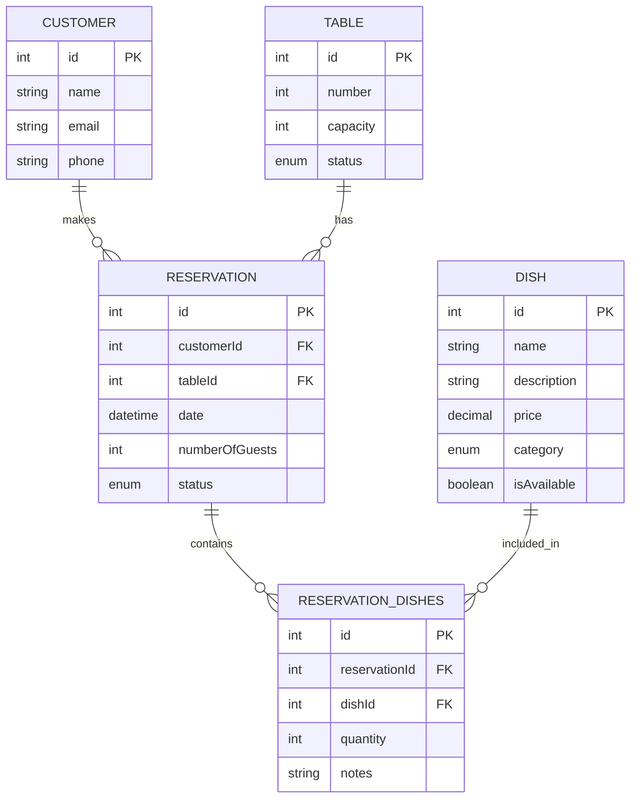

# Capítulo 2: Recursos

## 2.1 Arquitetura Técnica

### 2.1.1 Visão Geral da Arquitetura
O sistema segue uma arquitetura moderna de três camadas:

### 2.1.2 Componentes Principais
- **Frontend**: Single Page Application (SPA) construída com React Admin
- **Backend**: API REST com Express.js
- **Database**: Sistema relacional MySQL
- **ORM**: Sequelize para mapeamento objeto-relacional
- **Container**: Docker para desenvolvimento e implantação

## 2.2 Banco de Dados

### 2.2.1 Modelo de Dados

### 2.2.2 Índices e Otimizações
- Índices em chaves estrangeiras
- Índice em número de mesa para busca rápida
- Índice em data de reserva para consultas temporais

## 2.3 API REST

### 2.3.1 Endpoints Principais

#### Clientes
- `GET /api/customers` - Lista todos os clientes
- `POST /api/customers` - Cria novo cliente
- `GET /api/customers/:id` - Obtém cliente específico
- `PUT /api/customers/:id` - Atualiza cliente
- `DELETE /api/customers/:id` - Remove cliente

#### Reservas
- `GET /api/reservations` - Lista todas as reservas
- `POST /api/reservations` - Cria nova reserva
- `GET /api/reservations/:id` - Obtém reserva específica
- `PUT /api/reservations/:id` - Atualiza reserva
- `DELETE /api/reservations/:id` - Cancela reserva

### 2.3.2 Headers e Status Codes
- Uso de Content-Range para paginação
- Códigos HTTP apropriados (200, 201, 404, etc.)
- CORS configurado para desenvolvimento

## 2.4 Segurança

### 2.4.1 Validações
- Validação de dados de entrada
- Sanitização de dados
- Validações de negócio (ex: capacidade da mesa)

### 2.4.2 Proteção de Dados
- Validação de e-mail único
- Proteção contra SQL Injection via ORM
- Validação de formato de telefone

## 2.5 Frontend

### 2.5.1 Componentes React Admin
- Uso do Material-UI para interface consistente
- Componentes personalizados para dashboard
- Formulários com validação em tempo real

### 2.5.2 Performance
- Lazy loading de componentes
- Caching de dados no cliente
- Otimização de queries no backend